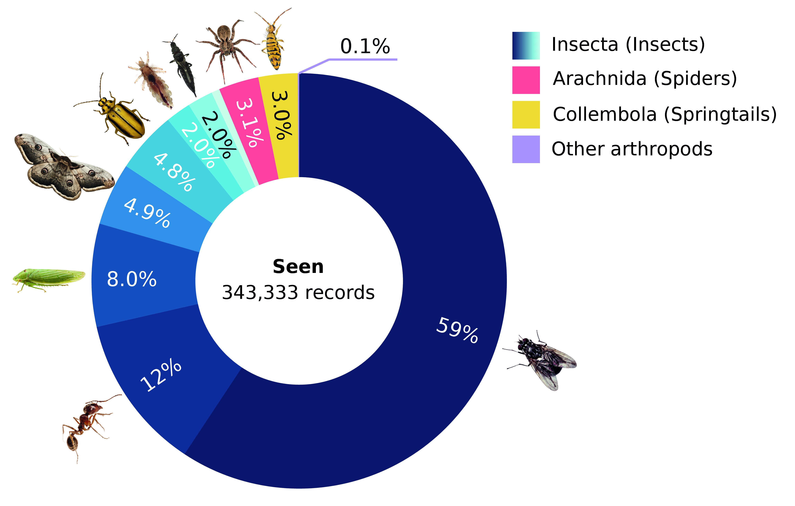
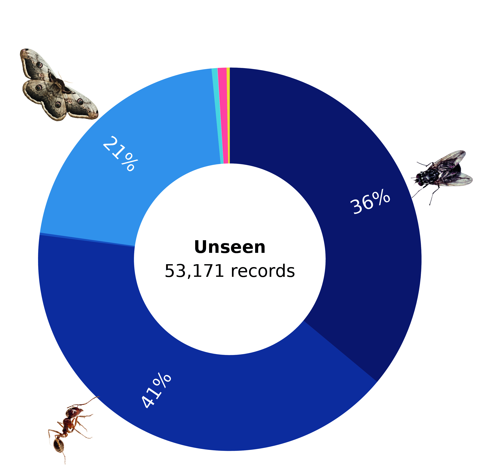
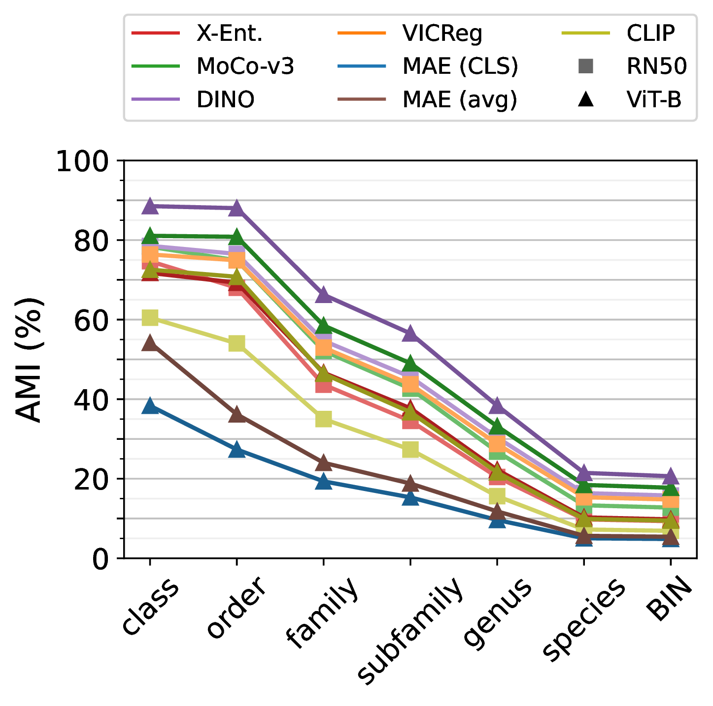
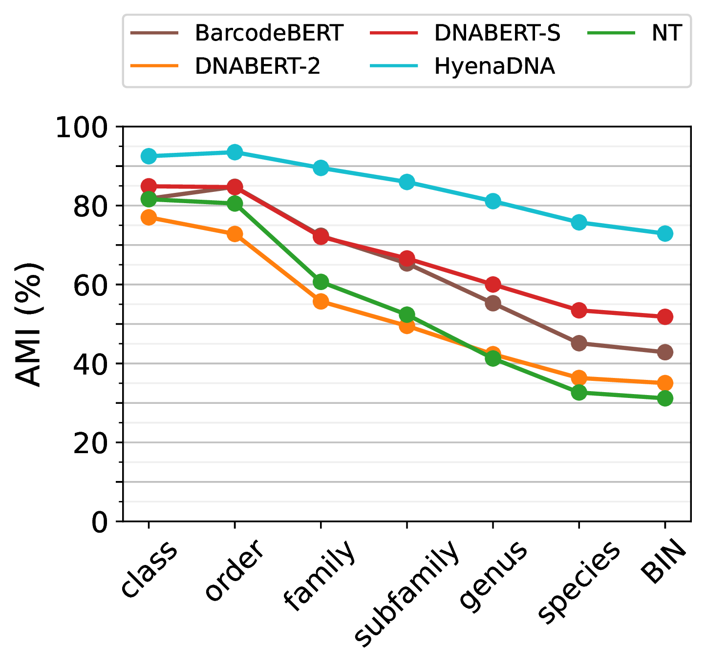
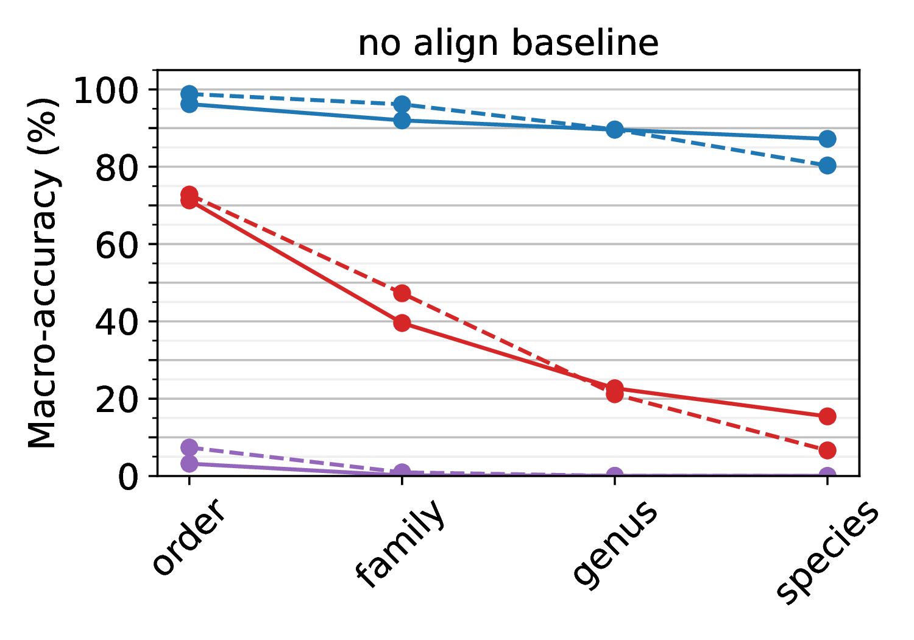
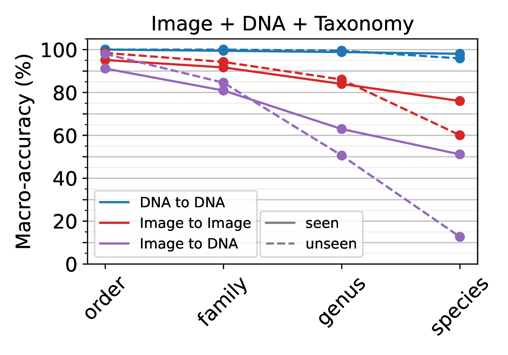

BIOSCAN-5M
==========
<div align="center">
  
  <p><b>Figure 1:</b> A BIOSCAN-5M dataset sample with multimodal data types.
</div>


Overview
--------
This repository contains the code and data related to the [BIOSCAN-5M](https://biodiversitygenomics.net/5M-insects/)
project.
BIOSCAN-5M is a comprehensive multi-modal dataset comprised of over 5 million specimens, 98% of which are insects.
Every record has **both image and DNA** data.

If you make use of the BIOSCAN-5M dataset and/or this code repository, please cite the following [paper](https://arxiv.org/abs/2406.12723):

```bibtex
@misc{gharaee2024bioscan5m,
    title={{BIOSCAN-5M}: A Multimodal Dataset for Insect Biodiversity},
    author={Zahra Gharaee and Scott C. Lowe and ZeMing Gong and Pablo Millan Arias
        and Nicholas Pellegrino and Austin T. Wang and Joakim Bruslund Haurum
        and Iuliia Zarubiieva and Lila Kari and Dirk Steinke and Graham W. Taylor
        and Paul Fieguth and Angel X. Chang
    },
    year={2024},
    eprint={2406.12723},
    archivePrefix={arXiv},
    primaryClass={cs.LG},
    doi={10.48550/arxiv.2406.12723},
}
```

Dataset
-------
We present BIOSCAN-5M dataset to the machine learning community.
We hope this dataset will facilitate the development of tools to automate aspects of the monitoring of global insect biodiversity.

Each record of the BIOSCAN-5M dataset contains six primary attributes:
* RGB image
  * Metadata field: <code>processid</code>
* DNA barcode sequence
  * Metadata field: <code>dna_barcode</code>
* Barcode Index Number (BIN)
  * Metadata field: <code>dna_bin</code>
* Biological taxonomic classification
  * Metadata fields: <code>phylum</code>, <code>class</code>, <code>order</code>, <code>family</code>, <code>subfamily</code>, <code>genus</code>, <code>species</code>
* Geographical information 
  * Metadata fields: <code>country</code>, <code>province_state</code>, <code>latitude</code>, <code>longitude</code>
* Specimen size
  * Metadata fields: <code>image_measurement_value</code>, <code>area_fraction</code>, <code>scale_factor</code>


### Dataset Access
All dataset image packages and metadata files are accessible for download through the
[GoogleDrive](https://drive.google.com/drive/u/1/folders/1Jc57eKkeiYrnUBc9WlIp-ZS_L1bVlT-0) folder.
Additionally, the dataset is available on [Zenodo](https://zenodo.org/records/11973457),
[Kaggle](https://www.kaggle.com/datasets/zahragharaee/bioscan-5m), and [HuggingFace](https://huggingface.co/datasets/Gharaee/BIOSCAN-5M).
 

### Copyright and License 
The images and metadata included in the BIOSCAN-5M dataset available through this repository are subject to copyright 
and licensing restrictions shown in the following:

 - Copyright Holder: CBG Photography Group
 - Copyright Institution: Centre for Biodiversity Genomics (email:CBGImaging@gmail.com)
 - Photographer: CBG Robotic Imager
 - Copyright License: Creative Commons Attribution 3.0 Unported ([CC BY 3.0](https://creativecommons.org/licenses/by/3.0/))
 - Copyright Contact: collectionsBIO@gmail.com
 - Copyright Year: 2021

### Getting Started with BIOSCAN-5M

#### 1. Environment Setup
To set up the BIOSCAN-5M project, create the required environment using the provided `bioscan5m.yaml` file. Run the following command:

```bash
conda env create -f bioscan5m.yaml
``` 

#### 2. Dataset Quick Start

Quickly access the BIOSCAN-5M dataset by installing the dataset package and initializing the data loader. Use the following commands:

```bash
pip install bioscan-dataset
``` 

```bash
from bioscan_dataset import BIOSCAN5M

ds = BIOSCAN5M("~/Datasets/bioscan-5m", download=True)
```
For more detailed information, please see the [BIOSCAN-5M Package](https://github.com/bioscan-ml/dataset)

#### 3. Task-Specific Settings
Please note that to work with all modules connected to this repository, 
you may need to install additional dependencies specific to each module (if any).
Be sure to follow the instructions provided within each module's folder for further setup details.

### Metadata 
The dataset metadata file **BIOSCAN_5M_Insect_Dataset_metadata** contains biological information, geographic information as well as 
size information of the organisms. We provide this metadata in both CSV and JSONLD file types.


### RGB Image 
The BIOSCAN-5M dataset comprises resized and cropped images.
We have provided various packages of the BIOSCAN-5M dataset, each tailored for specific purposes.

<div align="center">
  
  <p><b>Figure 2:</b> Examples of the original images of the BIOSCAN-5M dataset.
</div>

#### Cropped images
We trained a model on examples from this dataset in order to create a tool introduced in [BIOSCAN-1M](https://github.com/zahrag/BIOSCAN-1M), which can automatically generate bounding boxes around the insect.
We used this to crop each image down to only the region of interest.

#### Image packages
* **BIOSCAN_5M_original_full**: The raw images of the dataset.
* **BIOSCAN_5M_cropped**: Images after cropping with our cropping tool.
* **BIOSCAN_5M_original_256**: Original images resized to 256 on their shorter side. 
* **BIOSCAN_5M_cropped_256**: Cropped images resized to 256 on their shorter side.
 

<table>
  <thead>
    <tr style="background-color: #f2f2f2;">
      <th>BIOSCAN_5M_original_full</th>
      <th>BIOSCAN_5M_cropped</th>
    </tr>
  </thead>
  <tbody>
    <tr>
      <td>
        <ul>
          <li>BIOSCAN_5M_original_full.01.zip</li>
          <li>BIOSCAN_5M_original_full.02.zip</li>
          <li>BIOSCAN_5M_original_full.03.zip</li>
          <li>BIOSCAN_5M_original_full.04.zip</li>
          <li>BIOSCAN_5M_original_full.05.zip</li>
        </ul>
      </td>
      <td>
        <ul>
          <li>BIOSCAN_5M_cropped.01.zip</li>
          <li>BIOSCAN_5M_cropped.02.zip</li>
        </ul>
      </td>
    </tr>
    <tr style="background-color: #f2f2f2;">
      <th>BIOSCAN_5M_original_256</th>
      <th>BIOSCAN_5M_cropped_256</th>
    </tr>
    <tr>
      <td>
        <ul>
          <li>BIOSCAN_5M_original_256.zip</li>
          <li>BIOSCAN_5M_original_256_pretrain.zip</li>
          <li>BIOSCAN_5M_original_256_train.zip</li>
          <li>BIOSCAN_5M_original_256_eval.zip</li>
        </ul>
      </td>
      <td>
        <ul>
          <li>BIOSCAN_5M_cropped_256.zip</li>
          <li>BIOSCAN_5M_cropped_256_pretrain.zip</li>
          <li>BIOSCAN_5M_cropped_256_train.zip</li>
          <li>BIOSCAN_5M_cropped_256_eval.zip</li>
        </ul>
      </td>
    </tr>
  </tbody>
</table>


### Geographical Information
The BIOSCAN-5M dataset provides Geographic information associated with the collection sites of the organisms. 
The following geographic data is presented in the <code>country</code>, <code>province_state</code>, <code>latitude</code>, and 
<code>longitude</code> fields of the metadata file(s):
* Latitude and Longitude coordinates
* Country
* Province or State

<figure style="text-align: center;">
  
  <figcaption><b>Figure 3:</b> Locations obtained from latitude and longitude coordinates associated with the sites of collection.</figcaption>
</figure>

<br><br>

<div align="center">
  
  <p><b>Figure 4:</b> Countries associated with the sites of collection.
</div>

### Size Information
The BIOSCAN-5M dataset provides information about size of the organisms. 
The size data is presented in the <code>image_measurement_value</code>, <code>area_fraction</code>, and 
<code>scale_factor</code> fields of the metadata file(s):

* Image measurement value: Total number of pixels occupied by the organism

Furthermore, utilizing our cropping tool, we calculated the following information about size of the organisms:
* Area fraction: Fraction of the original image, the cropped image comprises.
* Scale factor: Ratio of the cropped image to the cropped and resized image.

<figure style="text-align: center;">
  
  <figcaption><b>Figure 5:</b> Examples of original images (top) and their corresponding masks (bottom) depicting pixels occupied by the organism.</figcaption>
</figure>


Benchmark Experiments
---------------------

### Data Partitions
We partitioned the BIOSCAN-5M dataset into splits for both closed-world and open-world machine learning problems. 
To use the partitions we propose, see the <code>split</code> field of the metadata file(s).


* The **closed-world** classification task uses samples labelled with a scientific name for their species
(<code>train</code>, <code>val</code>, and <code>test</code> partitions).
  * This task requires the model to correctly classify new images and DNA barcodes of across a known set of species labels that were seen during training.

* The **open-world** classification task uses samples whose species name is a placeholder name,
and whose genus name is a scientific name
(<code>key_unseen</code>, <code>val_unseen</code>, and <code>test_unseen</code> partitions).
  * This task requires the model to correctly group together new species that were not seen during training.
  * In the retreival paradigm, this task can be performed using <code>test_unseen</code> records as queries against keys from the <code>key_unseen</code> records.
  * Alternatively, this data can be evaluated at the genus-level by classification via the species in the <code>train</code> partition.

* Samples labelled with placeholder species names, and whose genus name is not a scientific name are placed in the <code>other_heldout</code> partition.
  * This data can be used to train an unseen species novelty detector.

* Samples without species labels are placed in the <code>pretrain</code> partition, which comprises 90% of the data.
  * This data can be used for self-supervised or semi-supervised training. 

<div align="center" style="display: flex; justify-content: center; gap: 20px;">
  <div>
    
  </div>
  <div>
    
  </div>
</div>
<div align="left">
  <p><b>Distribution of class- and (Insecta) order-level taxa</b> for seen and unseen data partitions. The distributions reflect that of known and newly-discovered species, respectively.</p>
</div>


### Task-I: DNA-based taxonomic classification task
Two stages of the proposed semi-supervised learning set-up based on [BarcodeBERT](https://arxiv.org/abs/2311.02401). 
1. Pretraining: DNA sequences are tokenized using non-overlapping k-mers and 50% of the tokens are masked for the MLM task. 
Tokens are encoded and fed into a transformer model. The output embeddings are used for token-level classification. 
2. Fine-tuning: All DNA sequences in a dataset are tokenized using non-overlapping $k$-mer tokenization and all tokenized sequences, without masking, are passed through the pretrained transformer model.  Global mean-pooling is applied over the token-level embeddings and the output is used for taxonomic classification.

<div align="center">
  
  <p><b>Figure 9:</b> BarcodeBERT model architecture.
</div>

#### Results
The performance of the taxonomic classification using DNA barcode sequences of the BIOSCAN-5M dataset is summarized as follows:

**Performance of DNA-based sequence models** in closed- and open-world settings.  
For the closed-world setting, we show the species-level accuracy (%) for predicting seen species.  
For the open-world setting, we show genus-level accuracy (%) for unseen species, while using seen species to fit the model.  
_Bold values indicate the best result, and italicized values indicate the second best._

| Model          | Architecture   | SSL-Pretraining  | Tokens Seen   | Fine-tuned Seen: Species | Linear Probe Seen: Species | 1NN-Probe Unseen: Genus |
|----------------|----------------|------------------|---------------|--------------------------|---------------|-------------------------|
| CNN baseline   | CNN            | --               | --            | 97.70                    | --            | *29.88*                 |
| NT             | Transformer    | Multi-Species    | 300 B         | 98.99                    | 52.41         | 21.67                   |
| DNABERT-2      | Transformer    | Multi-Species    | 512 B         | *99.23*                  | 67.81         | 17.99                   |
| DNABERT-S      | Transformer    | Multi-Species    | ~1,000 B      | 98.99                    | **95.50**     | 17.70                   |
| HyenaDNA       | SSM            | Human DNA        | 5 B           | 98.71                    | 54.82         | 19.26                   |
| BarcodeBERT    | Transformer    | DNA barcodes     | 5 B           | 98.52                    | 91.93         | 23.15                   |
| **Ours**       | Transformer    | DNA barcodes     | 7 B           | **99.28**                | *94.47*       | **47.03**               |


### Task-II: Zero-shot transfer learning task
We follow the experimental setup recommended by [zero-shot clustering](https://arxiv.org/abs/2406.02465),
expanded to operate on multiple modalities.
1. Take pretrained encoders.
2. Extract feature vectors from the stimuli by passing them through the pretrained encoder.
3. Reduce the embeddings with UMAP.
4. Cluster the reduced embeddings with Agglomerative Clustering.
5. Evaluate against the ground-truth annotations with Adjusted Mutual Information.

<div align="center">
  
  <p><b>Figure 10:</b> BIOSCAN-ZSC model architecture.
</div>

#### Results
The performance of the zero-shot transfer learning experiments on the BIOSCAN-5M dataset is summarized as follows:

<div align="center" style="display: flex; justify-content: center; gap: 20px;">
  <div>
    
  </div>
  <div>
    
  </div>
</div>
<div align="left">

  <p><b>Zero-shot clustering AMI (\%) performance</b> across taxonomic ranks.
    For images (left), pretrained encoders only capture coarse-grained information, but with DNA barcodes (right), clustering yields high performance to species-level, even without model retraining.</div>

### Task-III: Multimodal retrieval learning task
Our experiments using the [BIOSCAN-CLIP](https://arxiv.org/abs/2405.17537) are conducted in two steps. 
1. Training: Multiple modalities, including RGB images, textual taxonomy, and DNA sequences, are encoded separately, 
and trained using a contrastive loss function. 
2. Inference: Image vs DNA embedding is used as a query, and compared to the embeddings obtained from a database of image, 
DNA and text (keys). The cosine similarity is used to find the closest key embedding, and the corresponding taxonomic label is used to classify the query.

<div align="center">
  
  <p><b>Figure 11:</b> CLIBD model architecture.
</div>

#### Results
The performance of the multimodal retrieval learning experiments on the BIOSCAN-5M dataset is summarized as follows:

<div align="center" style="display: flex; justify-content: center; gap: 20px;">
  <div>
    
  </div>
  <div>
    
  </div>
</div>
<div align="left">
  <p><b>Multimodal retrieval accuracy (\%)</b> on seen and unseen species across different methods of retrieval (image-to-image, image-to-DNA, and DNA-to-DNA).
    Left: retrieval accuracy before alignment of encoders. Right: retrieval accuracy after aligning images, DNA, and taxonomic labels.</div>


